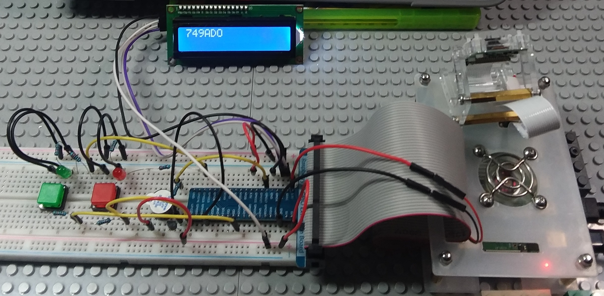

# License Plate Recognition with Raspberry Pi

We have successfully developed a license plate recognition system with Raspberry Pi. Please watch our presentation video for demo and more.

## Inspiration

- Based on market reports, License plate recognition will grow hugely in these five years due to a variety of applications. Such as security and surveillance, traffic enforcement, parking management, and so on.
- Automatic LPR Systems can add great values to business. Moreover, we now have more cutting-edge techniques, such as advanced image / video processing, machine learning, and so on.
- Raspberry Pi devices are commonly used in the industry of internet of things, because they are low cost, low energy consumption, and have many other goodies.
- People use Raspberry Pi to build smart homes, especially home security systems.

## What it does

Our LPR system runs on a Raspberry Pi device, and it is able to take photos of vehicle plates and then recognize plate numbers.

## How we built it

In our project, we write Python code to recognize license plates. This is the link to our GitHub repository. We utilize OpenCV for image processing and Tesseract OCR for image-to-text conversion.

## Challenges we ran into

- Learning Tesseract and tuning its parameters
- Setting up circuits for Raspberry Pi, such as LCD, buttons, buzzer, and LEDs.

## Accomplishments that we're proud of

We have achieved our goal of recognizing license plate using a raspberry pi within two days.

## What we learned
- Using OpenCV to process images
- Using Tesseract OCR engine to extract texts and their confidence scores
- Building circuits with Raspberry Pi

## What's next for License Plate Recognition with Raspberry Pi
- If we have more time, we plan to speed up the recognition process. For example, we can tune many parameters to optimize the image processing and recognition.
- We also want to recognize license plates in motion, and integrate our system with home security camera.

## Code File Description

- `LPR.py` 
    The code for image processing and recognition
- `controller.py`, `Adafruit_LCD1602.py`, `PCF8574.py`
    The code for control the circuits

## Circuit

